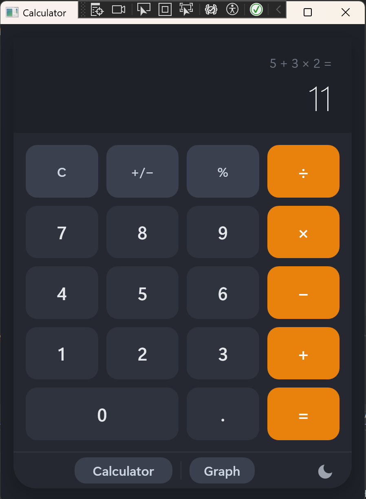
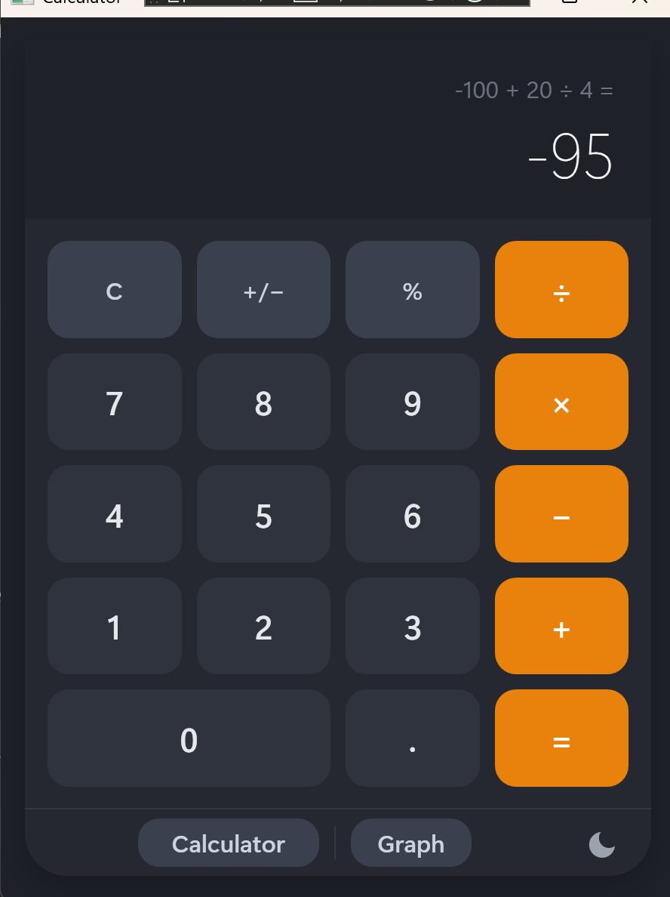
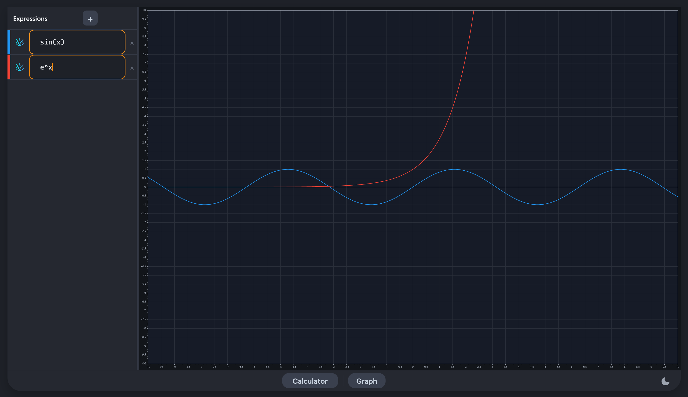

# 🧮 Calculator

> Desktop application for Windows built with **WPF** and **C#**, following the **MVVM** architectural pattern.
It offers two modes: a standard calculator and a graphical calculator for plotting mathematical functions.

---

## Table of Contents

- [License and authorship](#license-and-authorship)
- [System requirements](#system-requirements)
- [Main features](#main-features)
- [Installation guide](#installation-guide)
- [User guide](#user-guide)
- [Usage examples and screenshots](#usage-examples-and-screenshots)
- [Project structure](#project-structure)
- [Dependencies](#dependencies)
- [Conclusions and reflections](#conclusions-and-reflections)

---

## License and Authorship

| Field | Details |
|-------|---------|
| **Author** | [BlowingFever](https://github.com/BlowingFever) & [Arnaudevv](https://github.com/Arnaudevv) |
| **License** | MIT License |
| **Year** | 2026 |
| **Repository** | [Calculator](https://github.com/BlowingFever/Calculadora) |

```
MIT License

Copyright (c) 2026 BlowingFever

Permission is hereby granted, free of charge, to any person obtaining a copy
of this software and associated documentation files (the "Software"), to deal
in the Software without restriction...
```

See the [`LICENSE`](./LICENSE) file for the full license text.

---

## System Requirements ⚙️

Make sure you meet the following requirements before installing and running the application:

| Requirement | Minimum version |
|-------------|----------------|
| **Operating system** | Windows 10 / Windows 11 |
| **.NET SDK** | .NET 10.0 |
| **Recommended IDE** | Visual Studio 2022 or later |
| **NuGet** | Included with Visual Studio |

> ⚠ **Important:** The application uses WPF, which means it is **not compatible with Linux or macOS**.

---

## Main Features ✨

The application offers two calculators accessible from a bottom navigation bar:

### Standard Calculator
- Basic arithmetic operations: **addition, subtraction, multiplication and division**
- Support for mathematical expressions thanks to the **mXparser** library

### Graphical Calculator 📈
- Visual representation of **mathematical functions** on an interactive graph
- Graph rendering with **ScottPlot 5**
- Switch between the standard and graphical calculator without restarting the app

### Design and User Experience
- Navigation between modes via buttons in the bottom bar
- Custom **visual themes** managed in the `Themes` folder
- Pure **MVVM** architecture
- `DataContext` instantiated directly from XAML
- Icon support with `Assets` and `svg`

---

## Installation Guide 🚀

### Step 1 — Clone the repository

```bash
git clone https://github.com/BlowingFever/Calculadora.git
cd Calculadora
```

### Step 2 — Restore NuGet dependencies

Open a terminal at the project root and run:

```bash
dotnet restore
```

This will download the three required libraries:
- `MathParser.org-mXparser` (v6.1.1)
- `ScottPlot.WPF` (v5.1.58)
- `WPF-UI` (v4.3.0)

### Step 3 — Build the project

```bash
dotnet build
```

### Step 4 — Run the application

```bash
dotnet run
```

Alternatively, open `Calculadora.slnx` with **Visual Studio 2022** and press `F5` to start in debug mode.

> 💡 **Tip:** If you use Visual Studio, NuGet packages are restored automatically when you open the solution.

---

## User Guide

### Project Structure

```
Calculadora/
├── 📁 Common/          # Shared classes and utilities
├── 📁 Models/          # Data models
├── 📁 Themes/          # Resource dictionaries and themes
├── 📁 ViewModels/      # Presentation logic
│   └── MainViewModel.cs
├── 📁 Views/           # XAML user interfaces
├── 📄 App.xaml         # Global resources and Templates
├── 📄 App.xaml.cs      # Application entry point
├── 📄 MainWindow.xaml  # Main window
├── 📄 Calculadora.csproj
├── 📄 Calculadora.slnx
└── 📄 LICENSE
```

---

### Using the Standard Calculator

**Step 1.** When the application starts, the **Standard Calculator** is shown by default.

**Step 2.** Type a mathematical expression in the input field. You can write expressions such as:
```
3 + 5
10 - 2 * 4 / 2
```

**Step 3.** Press the **"="** button to see the result of the operation.

**Step 4.** The result appears on the main screen. You can continue chaining more operations.

**Step 5.** Use the **"C"** button to clear the current operation and start over.

---

### Using the Graphical Calculator

**Step 1.** In the bottom bar, click **"Graphical Calculator"** to switch to graphical mode.

**Step 2.** Type a mathematical function in the text field. For example:
```
sin(x)
x*2 - 4
cos(x) + 0.5*x
```

**Step 3.** The graph will render automatically.

**Step 4.** Interact with the graph: zoom in or out using the mouse wheel and pan by clicking and dragging.

**Step 5.** To return to the standard calculator, click **"Normal Calculator"** in the bottom bar.

---

### Dependencies 📦

| NuGet Package | Version | Purpose |
|---------------|---------|---------|
| `MathParser.org-mXparser` | 6.1.1 | Evaluation of complex mathematical expressions |
| `ScottPlot.WPF` | 5.1.58 | Function graph rendering |
| `WPF-UI` | 4.3.0 | Modern UI components for WPF |

---

## Usage Examples and Screenshots

### Examples — Standard Calculator

| Input expression | Expected result |
|--------------------|----------------|
| `5 + 3 * 2` | `11` |
| `-100 + 20 / 4` | `-95`|

### Examples — Graphical Calculator

| Function | Description |
|----------|-------------|
| `sin(x)` | Standard sine wave |
| `e^x` | Exponential growth function |

### Application Interface
<table border="0" cellpadding="0" cellspacing="0" width="100%" style="border-collapse: collapse; border: none;">
  <tr>
    <td width="50%" style="border: none; padding: 5px;">
      
    </td>
    <td width="50%" style="border: none; padding: 5px;">
      
    </td>
  </tr>
</table>



---

## Conclusions and Reflections 💭

### Technical Learnings

This project has allowed us to dive deeper into several aspects of desktop application development with **C# and WPF**:

- **Strictly applied MVVM pattern:** The main window contains no logic whatsoever in its code-behind. All navigation between views is managed through `MainViewModel` and XAML bindings, which demonstrates a solid command of the pattern and greatly simplifies testing and maintenance.

- **ContentControl + DataTemplate-based navigation:** Instead of using frames or pages, the project changes the `CurrentView` property of the ViewModel and lets WPF select the appropriate `DataTemplate` from `App.xaml`. This is an elegant and non-invasive technique.

- **Third-party library integration:** The combination of `mXparser` for expression parsing and `ScottPlot` for visualization provides a very powerful foundation with minimal custom code.

### Future Improvements

- 🧪 Add **unit tests** for the ViewModels and calculation logic.
- 📜 Implement a **persistent calculation history** across sessions.
- 🌍 Add **localization** support (English, Spanish, Catalan).
- 📱 Explore **MAUI** to bring the app to cross-platform in the future.
- ♿ Improve **accessibility** with screen reader support.

### Final Reflection

This project is a solid example of how to apply good software design practices in an academic or personal context. The clear separation of concerns, the use of `ICommand` bindings, and two-way data binding make the code readable, testable, and extensible. The choice of `.NET 10` reflects a future-oriented approach, aligned with the latest capabilities of the Microsoft platform.

---

<p align="center">
  Made with ❤️ by <a href="https://github.com/BlowingFever">BlowingFever</a> & <a href="https://github.com/Arnaudevv">Arnaudevv</a> · MIT License · 2026
</p>